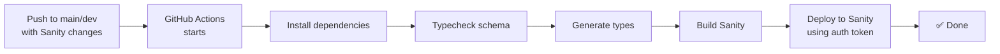

# Sanity Automated Deployment Setup

> **Note:** This is a template workflow for projects that use Sanity CMS. The current starter kit uses Storyblok.

This document explains how to set up automated Sanity deployments using GitHub Actions. The workflow is flexible and can be adapted to different project structures.

## Customizing for Your Project

Before using this workflow, you need to customize it for your specific project structure:

### 1. Update File Paths

In [.github/workflows/deploy-sanity.yml](.github/workflows/deploy-sanity.yml), update the `paths` trigger to match where your Sanity files are located:

```yaml
paths:
  # Choose the path that matches your project:
  - 'packages/sanity/**'     # Monorepo: packages/sanity/
  - 'apps/studio/**'         # Monorepo: apps/studio/
  - 'sanity/**'              # Root level: sanity/
  - 'studio/**'              # Root level: studio/
```

### 2. Update Commands

Update the commands based on your project structure:

**Option A: Monorepo with Workspaces (pnpm/yarn/npm)**
```yaml
run: pnpm --filter <your-workspace-name> typecheck
```
Examples: `@app/sanity`, `@company/studio`, `studio`

**Option B: Monorepo with Directory Navigation**
```yaml
run: cd packages/sanity && pnpm typecheck
```

**Option C: Single Package Project**
```yaml
run: pnpm typecheck
```

### 3. Required Scripts

Your Sanity package must have these scripts (or adjust the workflow commands):

```json
{
  "scripts": {
    "typecheck": "tsc --noEmit",
    "typegen": "sanity schema extract && sanity typegen generate",
    "build": "sanity build",
    "deploy": "sanity deploy"
  }
}
```

## GitHub Secrets Setup

To enable automated Sanity deployment, you need to add the following secrets to your GitHub repository:

### Required Secrets

1. **SANITY_AUTH_TOKEN** (Required)
   - This is your Sanity authentication token (deploy token)
   - Get it from: https://manage.sanity.io > API > Tokens
   - Create a token with "Deploy" permissions
   - **How to add**: Go to your GitHub repo Settings > Secrets and Variables > Actions > New repository secret

2. **SANITY_PROJECT_ID**
   - Your Sanity project ID
   - From `.example.env`: get it from sanity project dasboard
   - Add as GitHub secret

3. **SANITY_DATASET**
   - Your Sanity dataset name
   - From `.example.env`: `production`
   - Add as GitHub secret

4. **SANITY_API_VERSION**
   - Your Sanity API version
   - From `.example.env`: `2025-12-01`
   - Add as GitHub secret

## Setup Instructions

### Step 1: Get Your Sanity Auth Token

1. Go to [Sanity Manage](https://manage.sanity.io)
2. Select your project
3. Go to **API** > **Tokens**
4. Click **Add API token**
5. Name it (e.g., "GitHub CI/CD")
6. Give it **Deploy** permission
7. Copy the token

### Step 2: Add GitHub Secrets

1. Go to your GitHub repository
2. Click **Settings** > **Secrets and variables** > **Actions**
3. Click **New repository secret** and add each required secret:

   ```
   Name: SANITY_AUTH_TOKEN
   Value: <your-token-from-step-1>
   ```

   ```
   Name: SANITY_PROJECT_ID
   Value: check sanity dashboard for project Id
   ```

   ```
   Name: SANITY_DATASET
   Value: production
   ```

   ```
   Name: SANITY_API_VERSION
   Value: 2025-12-01
   ```

### Step 3: Verify Setup

The workflow will automatically:
- Run when you push to `main` or `dev` branches AND changes include your Sanity directory (as configured in the workflow)
- Typecheck your Sanity schema
- Generate types from the schema
- Build the Sanity project
- Deploy to Sanity cloud
- Can be manually triggered via **Actions** > **Deploy Sanity** > **Run workflow**

## How It Works



## Local Development

You can deploy manually using commands that match your project structure:

**Monorepo with Workspaces:**
```bash
# Using workspace filter
pnpm --filter @app/sanity deploy

# Or with npm/yarn
npm run deploy --workspace=@app/sanity
yarn workspace @app/sanity deploy
```

**Monorepo with Directory Navigation:**
```bash
cd packages/sanity  # or apps/studio, sanity/, etc.
pnpm deploy
```

**Single Package:**
```bash
pnpm deploy
```

**Direct Sanity CLI:**
```bash
# From Sanity directory
cd packages/sanity  # adjust path as needed
npx sanity deploy
```

## Troubleshooting

### Workflow fails with "Invalid auth token"

- Check that `SANITY_AUTH_TOKEN` is correctly set in GitHub Secrets
- Verify the token has "Deploy" permission in Sanity Manage
- Try regenerating the token

### Workflow not triggering

- Check that you're pushing to `main` or `dev` branch
- Verify changes include files in your configured Sanity directory (check the `paths` in the workflow file)
- Ensure the paths in the workflow match your actual project structure
- You can manually trigger it via GitHub Actions

### Build or deploy fails

- Check the GitHub Actions logs for error details
- Verify all secrets are correctly set
- Verify workspace names and paths match your project structure
- Ensure your schema is valid by running typecheck locally
- Check that all required scripts exist in your package.json

### Commands not found or workspace errors

- Verify the workspace/package name matches what's in your package.json
- For pnpm workspaces, ensure your root package.json has `"workspaces": ["packages/*"]` (or appropriate path)
- Try the alternative command approach (cd into directory instead of using --filter)

## Additional Notes

- The workflow only runs when Sanity package files change (to save GitHub Actions minutes)
- You can manually trigger it via the GitHub Actions UI
- All required environment variables are provided during the workflow

## Setting Up Sanity (For Future Use)

When you're ready to add Sanity to this project, you can choose the structure that fits your needs:

### Option A: Monorepo Structure

Good for larger projects with multiple packages.

```bash
# Create packages directory
mkdir -p packages/sanity

# Initialize Sanity
cd packages/sanity
npm create sanity@latest

# Update workflow paths to: 'packages/sanity/**'
# Update commands to: pnpm --filter @app/sanity <script>
```

### Option B: Apps Directory Structure

Common in modern monorepos (Turborepo, Nx).

```bash
# Create apps directory
mkdir -p apps/studio

# Initialize Sanity
cd apps/studio
npm create sanity@latest

# Update workflow paths to: 'apps/studio/**'
# Update commands to: pnpm --filter studio <script>
```

### Option C: Root Level Directory

Simpler structure for smaller projects.

```bash
# Create sanity directory at root
mkdir sanity

# Initialize Sanity
cd sanity
npm create sanity@latest

# Update workflow paths to: 'sanity/**'
# Update commands to: cd sanity && pnpm <script>
```

### Option D: Integrated in Main App

For single-package projects where Sanity is part of the main app.

```bash
# Install Sanity in your main project
pnpm add sanity @sanity/client

# Add Sanity scripts to your main package.json
# Update workflow paths to match your source directory
# Update commands to: pnpm <script>
```

### Configure Workspace (For Monorepos)

If using a monorepo, configure workspaces in your root `package.json`:

```json
{
  "name": "your-project",
  "workspaces": [
    "packages/*"
    // or "apps/*"
  ]
}
```

And set the package name in your Sanity `package.json`:

```json
{
  "name": "@app/sanity",  // or @company/studio, studio, etc.
  "version": "1.0.0",
  "scripts": {
    "typecheck": "tsc --noEmit",
    "typegen": "sanity schema extract && sanity typegen generate",
    "build": "sanity build",
    "deploy": "sanity deploy"
  }
}
```

### Add Environment Variables

The workflow expects these as GitHub Secrets, but locally you'll need them:

```
SANITY_STUDIO_PROJECT_ID=your-project-id
SANITY_STUDIO_DATASET=production
SANITY_STUDIO_API_VERSION=2025-12-01
```

Once set up, customize the workflow paths and commands to match your chosen structure.
